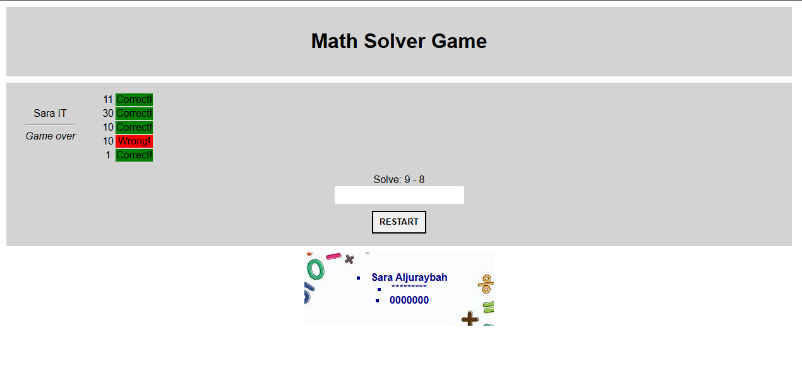

# 🎮 Math Solver Game

An interactive math quiz game built using **HTML, CSS, and JavaScript**.  
Players must solve 5 random math questions — including addition, subtraction, and multiplication — to test their speed and accuracy.

---

## 🚀 Features
- 🔢 Random math question generation  
- 🧠 Automatic answer checking  
- 🎨 Colored feedback (green = correct, red = wrong)  
- 🔄 Restart button to start a new game instantly  
- 👤 Displays player's name in the sidebar  
- 🧮 Beginner-friendly JavaScript logic  

---

## 🛠 Technologies Used
- HTML5  
- CSS3  
- JavaScript (Vanilla JS)

---

## 🖼 Preview


## 📷 Live Demo
You can play the game here:

👉 **https://YOUR_USERNAME.github.io/math-solver-game/**

*(Replace `YOUR_USERNAME` with your GitHub username)*

---

## 📂 Project Structure
```
math-solver-game/
│── index.html
│── style.css
│── javascript.js
│── mathbg.png
│── README.md
```


## 🎯 How to Play
1. Enter your name when prompted.  
2. Solve the question shown at the top.  
3. Click **ENTER** to submit your answer.  
4. After 5 rounds, the game ends.  
5. Click **RESTART** to start a new game.

---

## 👩‍💻 Developer
**Sara Aljuraybah**  

---
